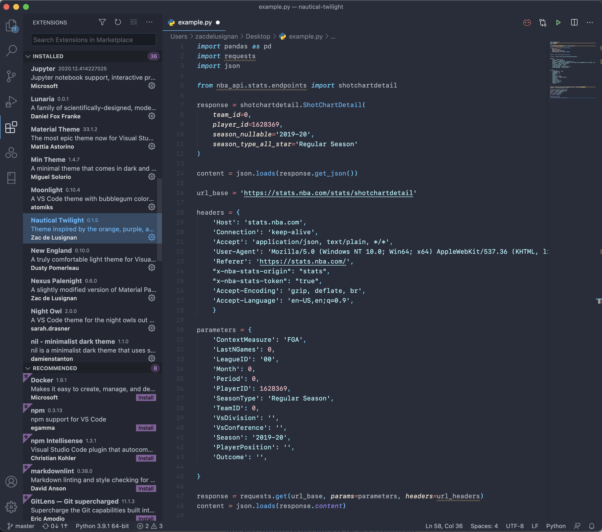

# Nautical Twilight

A VSCode theme inspired by the sunset over the water 🌅⚓

> Note: This theme is in early development and is subject to change frequently and significantly.

## Screenshots

## Supported Languages
* Python
* Julia

## Acknowledgments
Nautical Twilight was influenced by:
* [Ariake Dark](https://marketplace.visualstudio.com/items?itemName=wart.ariake-dark)
* [Ayu](https://marketplace.visualstudio.com/items?itemName=teabyii.ayu)
* [In Bed By 7pm](https://marketplace.visualstudio.com/items?itemName=sdras.inbedby7pm)
* [Material](https://marketplace.visualstudio.com/items?itemName=Equinusocio.vsc-material-theme)
* Atom's [One Dark Pro](https://atom.io/themes/one-dark-syntax)