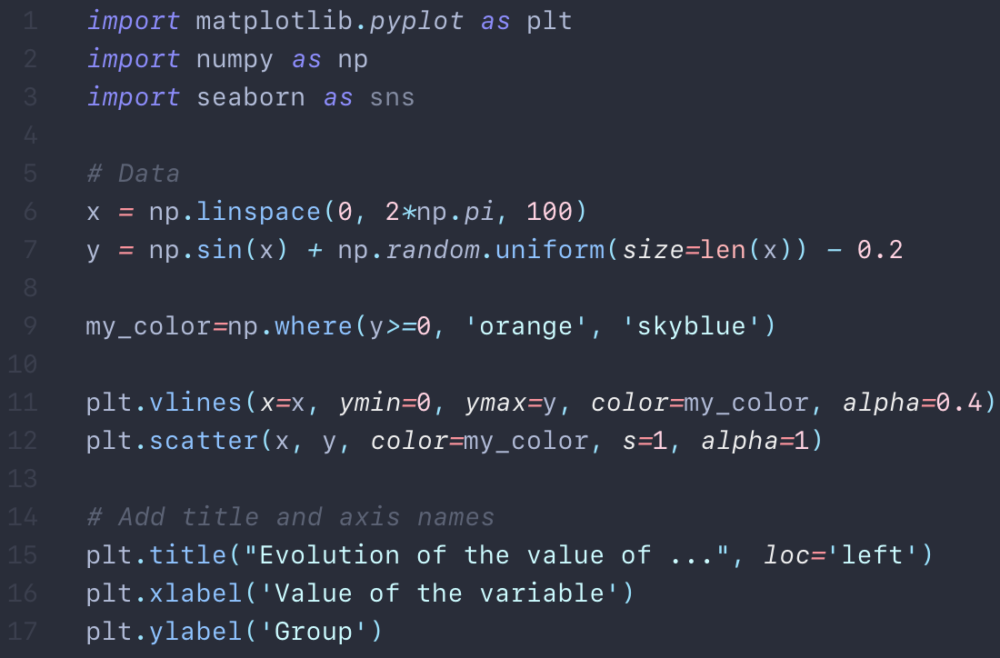

# Nautical Twilight

A nautical grey-blue theme for [Visual Studio Code](https://code.visualstudio.com). 🌅⚓

## Screenshots

### Python

### Jupyter Notebooks

## Acknowledgments
Nautical Twilight was influenced by:
* [Ariake Dark](https://marketplace.visualstudio.com/items?itemName=wart.ariake-dark)
* [Ayu](https://marketplace.visualstudio.com/items?itemName=teabyii.ayu)
* [In Bed By 7pm](https://marketplace.visualstudio.com/items?itemName=sdras.inbedby7pm)
* [Material](https://marketplace.visualstudio.com/items?itemName=Equinusocio.vsc-material-theme)
* Atom's [One Dark Pro](https://atom.io/themes/one-dark-syntax)